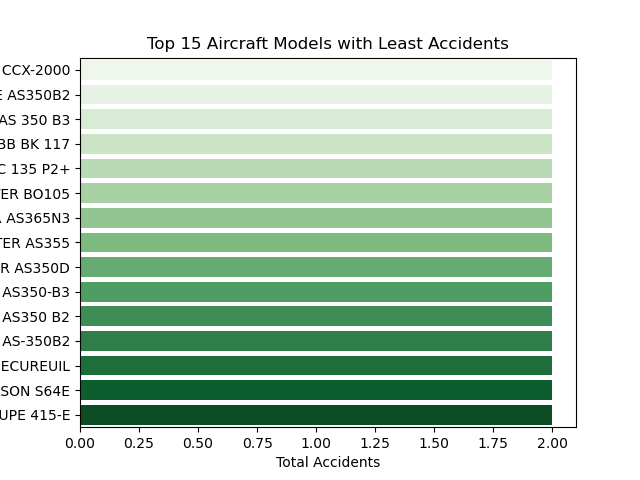

# Aviation Risk Analysis - README

# Project Overview
This project analyzes aviation accident data to determine which aircraft present the lowest risk as part of a business initiative to enter the aviation industry. The analysis includes data cleaning, imputation, aggregation, and visualization to generate actionable insights for aviation investment decisions.

# Business Problem
As the company seeks to expand into aviation operations, it needs data-driven guidance on which aircraft to purchase for commercial and private use. By leveraging aviation accident records from 1962 to 2023, we can identify patterns and risk factors associated with different aircraft, flight purposes, and conditions.

# Dataset
The dataset comes from the National Transportation Safety Board and includes:
- Flight purpose and operation type
- Phase of flight (e.g., takeoff, landing)
- Weather conditions
- Aircraft make and model
- Injury data from aviation accidents

# Key Findings
### 1. **Risk by Flight Purpose**
- **Lowest risk:** Aerial Application, Banner Towing, Glider Towing
- **Highest risk:** Executive/Corporate and Skydiving flights

### 2. **Risk by Flight Phase**
- **Lowest injuries:** Maneuvering, Go-around, Landing
- **Highest injuries:** Taxiing, Standing, Climb/Descent

### 3. **Weather Conditions Impact**
- **VMC (Clear Weather):** Lowest injury rate
- **IMC (Poor Visibility):** Double the injury rate compared to VMC
- **Unknown Conditions:** Extremely high injury rates, linked to severe incidents

### 4. **Aircraft Make/Model Risk**
- **Most recorded accidents:** Certain models like the Cessna 172 and Piper PA28 appear frequently in accident data, possibly due to high operational volume.

- **Least recorded accidents:** Some models show consistently low accident counts and may reflect safer or less exposed aircraft.

## Business Recommendations

### From Flight Purpose Analysis
- **Recommendation:** Focus on low-risk operations such as Aerial Application and Glider Towing for initial entry into aviation. These purposes show consistently low injury rates and may require less capital-intensive setups.

### From Flight Phase Analysis
- **Recommendation:** Prioritize aircraft with robust takeoff, landing, and maneuvering capabilities. These phases represent the majority of accidents but have manageable injury rates when mitigated by strong operational safety practices.

### From Weather Condition Analysis
- **Recommendation:** Equip all aircraft with advanced instrumentation and training protocols for IMC (Instrument Meteorological Conditions). Clear weather (VMC) operations should be prioritized where feasible to reduce risk.

### From Aircraft Make/Model Analysis
- **Recommendation:** Prioritize aircraft models with consistently low accident counts when considering initial fleet acquisition or expansion. Use accident frequency alongside severity and usage context for balanced decisions.

## Next Steps
- Build an interactive dashboard to support executive decisions
- Refine aircraft selection criteria with expert validation
- Incorporate findings into procurement and training plans

For further inquiries or improvements, please contact the aviation analytics team.

